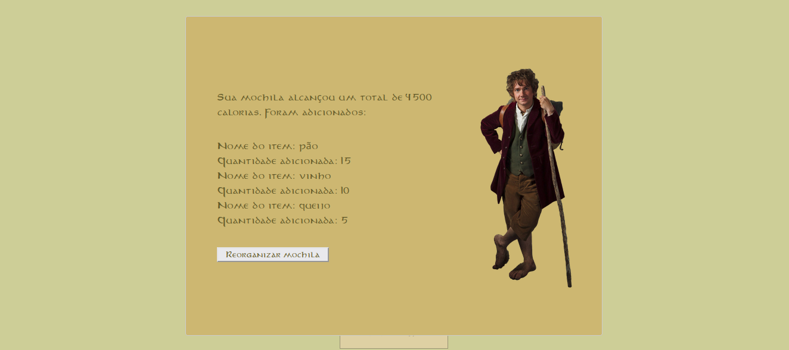

# Bilbo Bolseiro

**Número da Lista**: 42 
**Conteúdo da Disciplina**: Greed 

## Alunos
|Matrícula | Aluno |
| -- | -- |
| 17/0045269  |  Sara Campos |

## Sobre 
Este projeto utiliza o algoritmo ambicioso Knapsack para ajudar o hobbit Bilbo Bolseiro a escolher as melhores comidas para levar em sua jornada inesperada. 

## Screenshots

## Instalação 
**Linguagem**: JavaScript 
**Framework**: ReactJS 
Para rodar o projeto é necessário inicialmente rodar os seguintes comandos: 

    cd bilbo
    npm install
    npm start

## Uso 
Após acessar o projeto no browser, o usuário irá encontrar uma página com algumas informações que o encaminhará para organizar a mochila de Bilbo Bolseiro. Já na página de organização, ele poderá informar a capacidade da mochila e adicionar quais alimentos deseja levar, a quantidade e calorias de cada um. A partir daí o algoritmo irá retornar a melhor mochila com o maior número de calorias. 

## Vídeo 
O vídeo explicando o projeto pode ser acessado através da pasta assets na raiz do projeto após a clonagem do repositório.

